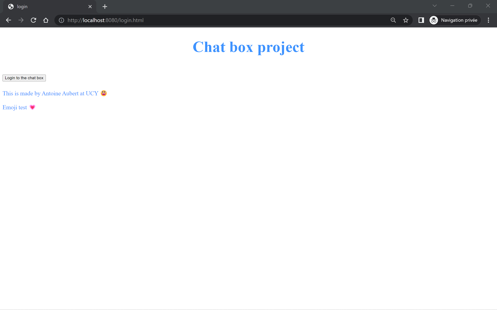
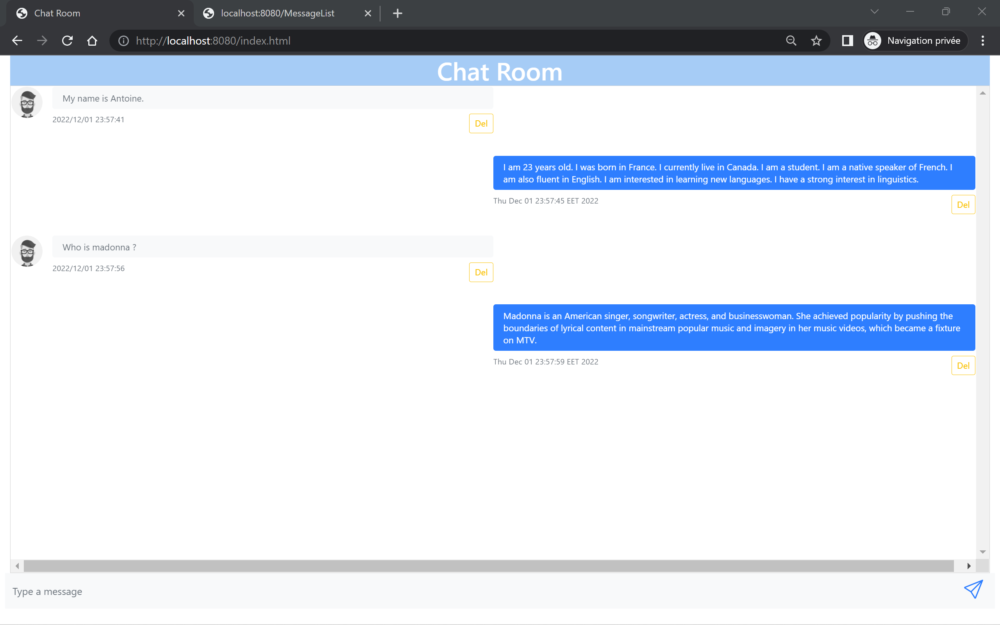
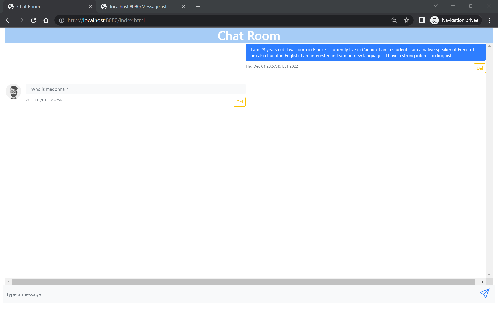
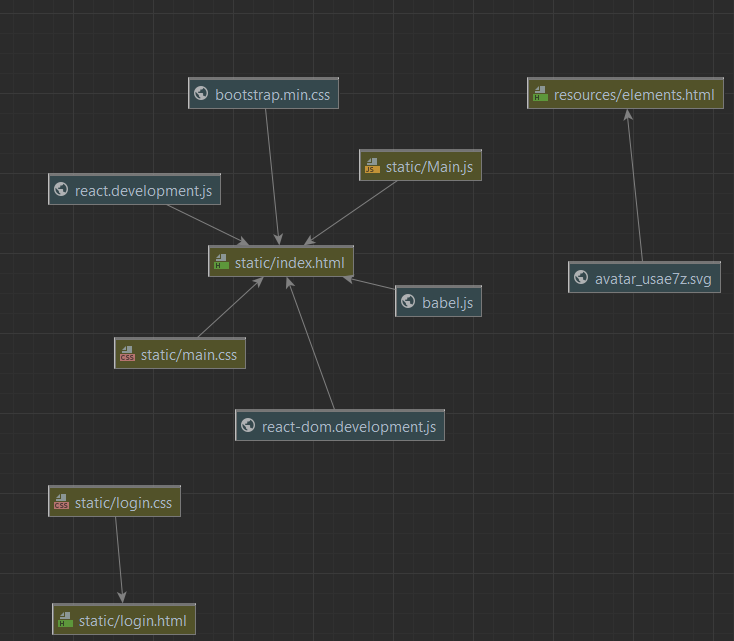
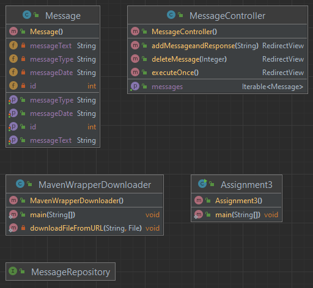

# JAVA Chat box :

This is a university project. 

### Optional thinks : 
Button place with bootstrap, add a login page with login.css -> colors and new font.

*** 

*** 
# class diagram : 

# author : 
Made by : Antoine Aubert 
Teacher : Maria Terzi